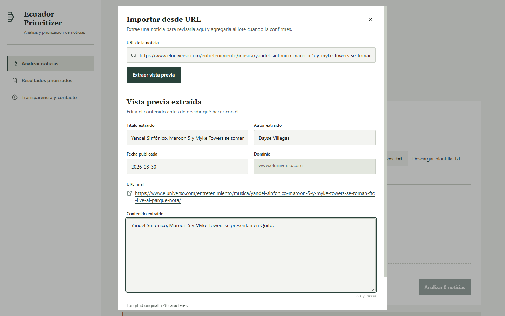
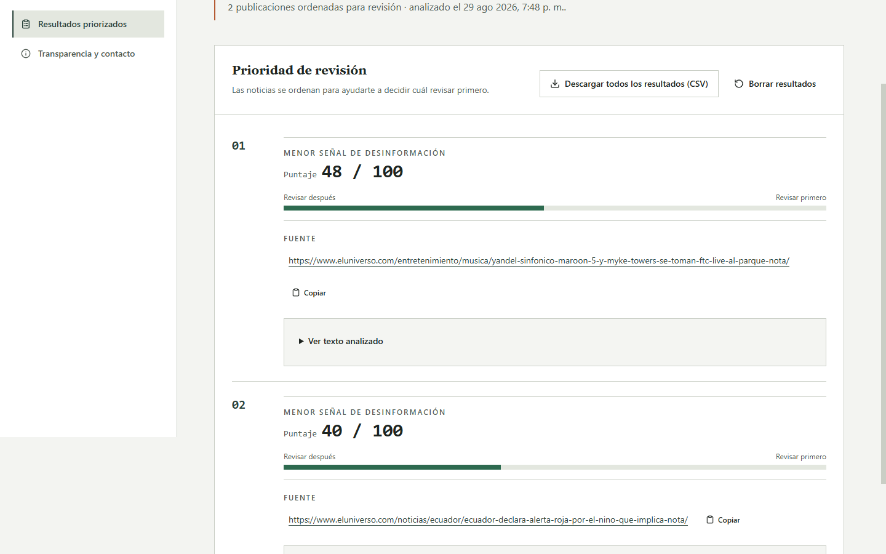

# Ecuador Prioritizer

Ecuador Prioritizer ayuda a equipos de verificación a **ordenar noticias y afirmaciones para revisión humana**. Entrega señales preliminares de priorización; no reemplaza la verificación profesional.

> Priorización preliminar para orientar la revisión humana de noticias y afirmaciones.

**Tecnologías del piloto:** <kbd>React</kbd> <kbd>Vite</kbd> <kbd>TypeScript</kbd> <kbd>FastAPI</kbd> <kbd>Python</kbd> <kbd>XGBoost</kbd> <kbd>Cloudflare Workers</kbd> <kbd>Render</kbd>

## Demo en vivo

Prueba la aplicación en [ecuador-prioritizer.scaizapa.workers.dev](https://ecuador-prioritizer.scaizapa.workers.dev/).

El piloto es anónimo y funciona por sesión: puedes importar una URL pública o cargar hasta 10 textos, revisar la vista previa y analizar el lote. Cada ítem admite hasta 2.000 caracteres.

## Qué hace y qué no hace

**Hace**

- Ordena un lote para sugerir qué revisar primero.
- Permite importar una URL, editar la vista previa y conservar los resultados durante la sesión.
- Muestra el origen de cada ítem y permite exportar el lote de resultados en CSV.

**No hace**

- No verifica hechos ni emite veredictos de verdad o falsedad.
- No decide sobre personas, no sustituye el criterio editorial y no ofrece un SLA.
- No ofrece cuentas, historial persistente, colas, expedientes ni una API pública.

## Cómo funciona

1. **Prepara el lote.** Agrega textos o importa URLs de noticias públicas.
2. **Revisa la vista previa.** Confirma o edita el título, el contenido y la fuente antes de agregar cada ítem.
3. **Analiza.** La aplicación envía el lote al servicio privado de priorización y muestra un orden relativo para revisión humana.
4. **Verifica por tu cuenta.** Contrasta las fuentes originales y aplica tu propio proceso editorial.

## Capturas del flujo

Las capturas se tomaron del Worker canónico en escritorio (1440 × 900), con dos URLs públicas de **El Universo**. El contenido fue reducido a frases breves para no redistribuir el cuerpo de los artículos.





Fuentes usadas en la captura: [Yandel Sinfónico, Maroon 5 y Myke Towers se toman FTC live al Parque](https://www.eluniverso.com/entretenimiento/musica/yandel-sinfonico-maroon-5-y-myke-towers-se-toman-ftc-live-al-parque-nota/) y [Ecuador declara alerta roja en todo el país por el fenómeno del Niño](https://www.eluniverso.com/noticias/ecuador/ecuador-declara-alerta-roja-por-el-nino-que-implica-nota/). La aplicación mostró la fecha publicada extraída para ambas vistas previas; se usaron únicamente el título, la URL, el dominio y texto breve editado.

## Privacidad y límite del modelo

- El piloto no requiere cuenta y está diseñado para uso anónimo y por sesión.
- No envíes información personal, credenciales, material protegido ni contenido sensible.
- El bundle privado del modelo está autorizado para la inferencia del piloto, pero el bundle, los artefactos y el dataset ecuatoriano obtenido por scraping no se publican.
- Las señales dependen del texto y de los datos disponibles; siempre requieren revisión humana.

## Tecnología

- **Frontend:** React + Vite, desplegado en Cloudflare Workers.
- **Priorización:** FastAPI + Python en un servicio privado de Render.
- **Pipeline:** TF-IDF + FEDA + XGBoost.

La arquitectura completa está en [docs/ARCHITECTURE.md](docs/ARCHITECTURE.md). El límite de publicación de modelos y datos está en [docs/PUBLICATION_POLICY.md](docs/PUBLICATION_POLICY.md) y [docs/PHASE_3_ASSET_GATE.md](docs/PHASE_3_ASSET_GATE.md).

## Desarrollo local

```bash
cd frontend
npm ci
npm run build
npm run lint
npm run typecheck
```

Para proponer cambios o reportar mejoras, use las [issues del proyecto](https://github.com/Sam-24-dev/ecuador-prioritizer/issues). Para operar o verificar el despliegue actual, consulte el [runbook de operaciones](docs/OPERATIONS_RUNBOOK.md). Los avisos de licencias del bundle público están en [THIRD_PARTY_NOTICES](THIRD_PARTY_NOTICES).

## Estado del piloto y limitaciones

Este es un piloto público sin garantía de disponibilidad ni SLA. La salida sirve para ordenar el trabajo de revisión, no para establecer la verdad de una afirmación ni para tomar decisiones sobre personas. El repositorio mantiene fuera del lanzamiento público el modelo privado, sus artefactos y los datos de entrenamiento.

## Licencia y contacto

El código se publica bajo [MIT](LICENSE). Para reportar una vulnerabilidad, consulte [SECURITY.md](SECURITY.md).

Samir Caizapasto — Propietario del proyecto y desarrollador full-stack de Ecuador Prioritizer.
