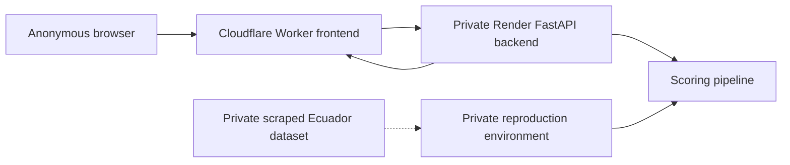

# Architecture

## Current boundary

The public product is a stateless web client backed by a private scoring API. The confirmed public frontend is the Cloudflare Worker at <https://ecuador-prioritizer.scaizapa.workers.dev/>. The FastAPI backend is a private Render service for this application; it is not documented here as a public API or integration.

This document describes product boundaries, not a production-readiness, uptime, or provider-dashboard claim. For current health checks, deployment inspection, evidence handling, and rollback, see the [Operations runbook](OPERATIONS_RUNBOOK.md).

## Components

| Component | Responsibility | Does not do |
|---|---|---|
| React/Vite frontend on Cloudflare Workers | Anonymous input, accessible results, local session state | Store user history or make verdicts |
| Private FastAPI backend on Render | Validate bounded requests and run scoring | Editorial workflow, accounts, or background jobs |
| Scoring pipeline | Produce prioritization signals | Establish truth or replace human review |
| Private reproduction environment | Retain private source material outside public Git/history | Serve public traffic |

## Data flow

1. A browser submits an item or batch within the documented product limits.
2. The frontend sends the request through the application's configured API boundary.
3. The private FastAPI service validates shape and size, computes features, runs the scoring pipeline, and returns ranked, non-definitive output.
4. The browser displays the result in memory for the current session only.
5. Operational records must exclude request bodies, tokens, and personal data; handling details belong in the [Operations runbook](OPERATIONS_RUNBOOK.md).

## Public/private boundary

| Public repository/release | Private only |
|---|---|
| Approved source, documentation, verified public datasets, and material explicitly cleared for release | Scraped Ecuador data, raw source content, credentials, operational logs, private runtime details, model/data bundles, snapshots, archives, and unapproved legacy material |
| Reproduction scripts that do not embed private data | Private ingestion/reproduction inputs and outputs |

The public repository does not publish the private dataset, private model bundle, deployment credentials, or private operational evidence. Publication decisions remain governed by [Publication policy](PUBLICATION_POLICY.md), not by `.gitignore` alone.

## Privacy and security

- Minimize inputs and avoid persistent storage by design.
- Enforce request size, content type, timeouts, and rate limits at public boundaries.
- Keep secrets in provider-managed configuration; never place them in source, artifacts, docs, browser bundles, or logs.
- Restrict CORS to the published frontend origin after deployment values are verified.
- Do not treat a model or dataset as public until its release gate passes.

## Reliability and observability

- Provide clear unavailable/error responses rather than silent fallback scores.
- Treat free-tier or low-cost availability as best effort; no SLA is claimed.
- These public docs do not claim continuous monitoring. Use the low-volume checks and provider-native inspection described in the [Operations runbook](OPERATIONS_RUNBOOK.md).
- Keep operational evidence privacy-safe and private; never put raw logs, request/response bodies, secrets, or private identifiers in public issues or documentation.

## Historical deployment plan (superseded)

The earlier design considered Cloudflare Pages for the static frontend and OCI Always Free compute for the FastAPI service, with an optional Cloudflare Worker gateway. That plan is retained as historical migration context only. Pages and OCI are **not** the current deployment boundary and the instructions below are not executable deployment guidance.

For any future provider change, re-verify provider terms, account eligibility, limits, network configuration, and release evidence before making a change. Do not infer current provider settings from this historical plan.

## YAGNI decisions

| Not included now | Why |
|---|---|
| Database | Session-only, stateless product has no demonstrated persistence need. |
| Accounts and roles | They create privacy and support obligations without serving prioritization. |
| Queues or background workers | Current scoring path is synchronous and bounded. |
| Microservices, DDD, Turborepo, Kubernetes | They add operational surface without a proven requirement. |
| Additional hosting providers | No evidence currently requires a provider change. |

Next: [Operations runbook](OPERATIONS_RUNBOOK.md).
