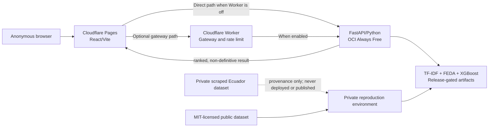

# Architecture

## Decision

Use one public web client and one stateless scoring API. Keep the model pipeline simple: TF-IDF → FEDA → XGBoost. No database is needed for the target product.

## Components

| Component | Responsibility | Does not do |
|---|---|---|
| React/Vite on Cloudflare Pages | Anonymous input, accessible results, local session state | Store user history or make verdicts |
| Optional Cloudflare Worker | Narrow gateway or rate limiting if abuse evidence justifies it | Business logic, persistence, or model execution |
| FastAPI on OCI Always Free | Validate bounded requests and run scoring | Editorial workflow, accounts, or background jobs |
| TF-IDF + FEDA + XGBoost artifacts | Produce prioritization signals | Establish truth or replace human review |
| Private reproduction environment | Retain private scraped source material outside public Git/history | Serve public traffic |

## Data flow

1. A browser submits an item or batch within future, documented size limits.
2. Pages sends the request directly to the API when the Worker is off, or through the optional Worker when it is enabled.
3. FastAPI validates shape and size, computes features, runs the model, and returns ranked non-definitive output.
4. The browser displays the result in memory for the current session only.
5. Operational logs must exclude request bodies, tokens, and personal data; retention details remain **[VERIFY BEFORE DEPLOYMENT]**.

## Public/private boundary

| Public repository/release | Private only |
|---|---|
| Approved source, documentation, MIT-licensed datasets with verified provenance, and eligible model artifacts | Scraped Ecuador dataset, raw source content, credentials, operational logs, snapshots, archives, unapproved legacy material, and model artifacts trained with private scraped data by default |
| Reproduction scripts that do not embed private data | Private ingestion/reproduction inputs and outputs |

Model artifacts trained with the private scraped dataset remain private by default. They may be public only after a documented review of rights, privacy, and leakage risk, or after exclusive reproduction with datasets whose public licenses and provenance are verified. The current model is not presumed public before that gate. The exact public content is controlled by [Publication policy](PUBLICATION_POLICY.md), not by `.gitignore` alone.

## Privacy and security

- Minimize inputs and avoid persistent storage by design.
- Enforce request size, content-type, timeouts, and rate limits at public boundaries.
- Keep secrets in provider-managed configuration; never in source, artifacts, docs, browser bundles, or logs.
- Restrict CORS to the published frontend origin(s) after deployment values are verified.
- Pin and scan dependencies when code is materialized.
- Do not treat a model as public until its artifact-release gate passes: exclusive verified-public-data reproduction, or documented rights, privacy, and leakage-risk approval.

## Reliability and observability

- Provide clear unavailable/error responses rather than silent fallback scores.
- Add health/readiness checks and bounded request timeouts during implementation.
- Capture privacy-safe health, latency, error-rate, release revision, and model-artifact identity signals.
- Treat free-tier availability as best effort; no free SLA is assumed.
- Define backup and restore evidence before public cutover; see [Free deployment](FREE_DEPLOYMENT.md).

## YAGNI decisions

| Not included now | Why |
|---|---|
| Database | Session-only, stateless product has no demonstrated persistence need. |
| Accounts and roles | They create privacy and support obligations without serving prioritization. |
| Queues or background workers | Current scoring path is synchronous and bounded. |
| Microservices, DDD, Turborepo, Kubernetes | They add operational surface without a proven requirement. |
| Vercel, Fly, Supabase | Not part of the target design; retained only as migration context if needed. |

Next: [Migration plan](MIGRATION_PLAN.md).
